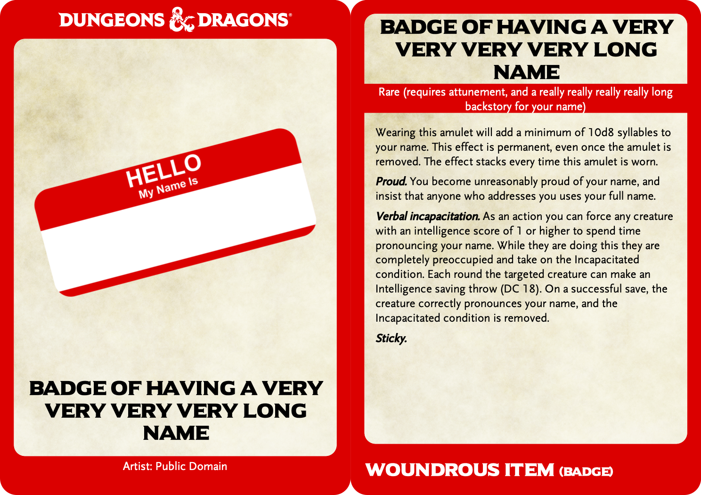

# Dungeons & Dragons Card Generator
A script to generate cards for Dungeons and Dragons in the style of the official Gale Force Nine ones.

At this time, only monster cards are supported

<meta property="og:image"
    content="https://raw.githubusercontent.com/ep1cman/DnD-Card-Generator/master/docs/monster.png" />


[](https://www.buymeacoffee.com/ep1cman)

# Setup
Before being able to use this script you will need to do the following:
 1. Install [Python 3](https://www.python.org/downloads/)
 1. Download and extract this repository (or use `git clone`)
 1. Open a terminal and navigate to the location you downloaded this repository to
 1. Run the following command from a terminals
 ```pip install -r requirements.txt```

# Usage
```
sage: CardGenerator.py [-h] [-t {monster,item}] [-o output_path] [-f {free,accurate}] [-b BLEED] [--no-bg | --bg BACKGROUND] input

Generate D&D cards.

positional arguments:
  input                 Path to input YAML file

optional arguments:
  -h, --help            show this help message and exit
  -t {monster,item}, --type {monster,item}
                        What type of cards to generate
  -o output_path, --out output_path
                        Output file path
  -f {free,accurate}, --fonts {free,accurate}
                        What fonts to use when generating cards
  -b BLEED, --bleed BLEED
                        How many millimeters of print bleed radius to add around each card.
  --no-bg               Do not add the 'parchment' effect background.
  --bg BACKGROUND       Custom background image to use
```
Included in the `example` directory are example YAML files.

# Input YAML
The input to this script is a YAML file that details all the attributes of the card. The details of what to include for each card type can be found below.

If you are having issues with your YAML file, you can use [YAML Lint](http://www.yamllint.com/) to verify your syntax. If that shows everything is ok, then double check your YAML matches the structure of the examples below. If you are still having issues, then please open a issue here on GitHub and I will try my best to assist.

Common Issues:
 - Entries that include a `:` must be surrounded by quotes `"` e.g: ``source: "System Reference Document: Page 315"``
 - The fields are case sensitive, make sure there are no capital letters. e.g ``title`` not ``Title``

You can add formatting to any of the fields that generate text using reportlab's paragraph XML markup tags. Documentation for this can be found in chapter 6.2 of the [reportlab user guide](https://www.reportlab.com/docs/reportlab-userguide.pdf).

## Monster Cards


Based on the Gale Force Nine Monster Cards. If the contents of the card exceeds the space available on a small card, it will automatically scale to a double width card, like the official ones. The front of the card is automatically oriented to best fit the aspect ratio of the image provided.

## YAML Entry fields
- **title** - The title of the card that will appear at the bottom of the front of the card, and at the top of the back of the card
- **subtitle** - The white text that appears below the title on the back of the card
- **artist** - If this is provided, and not blank, white text below the title on the front of the card will show the artist of the cards artwork.
- **image_path** - Path to the image to insert on the front of the card. This can either be a full path, or relative to the location of the YAML file.
- **armor_class** - The armor class of the monster (top left of the card), can include any text e.g. ``15 (Leather armor, shield)``
- **max_hit_points** - The max hit points of the monster (top right of the card), can include any text e.g. ``7 (2d6)``
- **speed** - The speed of the monster (below armor_class), can include any text e.g. ``30ft., fly 60 ft.``
- **strength, dexterity, constitution, intelligence, wisdom, charisma** - Ability modifiers show at the top of the card. They can also include ability scores e.g. `-1` or `8 (-1)`
- **challenge_rating** - The challenge rating of the monster, white text shown at the bottom of the back of the card
- **experience_points** - The experience points earned for defeating the monster, shown next to the challenge rating
- **source** - The source from which this cards information came from. e.g. ``"System Reference Document: Page 315"``
- **attributes** - A dictionary of the monsters "attributes", these appear in the top half of the second section of the card. Some common attributes include: `Skills`, `Senses`, `Languages`, `Damage Immunities`. The key will be typeset in **bold** while the value will be typeset as regular text.
- **abilities** - A dictionary of the monsters "abilities", these appear below the ``attributes`` in the second section of the card. The key will be typeset in *Italic* while the value will be typeset as regular text.
- **actions** - A dictionary of the monsters "actions", these appear in the third section of the card. The key will be typeset in **_Bold Italic_** while the value will be typeset as regular text.
- **legendary** - A list containing a single intro text along with entries as per abilities
- **color** - A color name (e.g. `red`), hex color code (e.g. `#0000dd`) or array of RGB colors (e.g. `[0.7, 0.7, 0]`).

### Example
``` YAML
- title: Goblin
  subtitle: Small humanoid (goblinoid), neutral evil
  artist: Public Domain
  image_path: example/Goblin.png
  armor_class: 15 (Leather armor, shield)
  max_hit_points: 7 (2d6)
  speed: 30 ft.
  strength: 8 (-1)
  dexterity: 14 (+2)
  constitution: 10 (+0)
  intelligence: 10 (+0)
  wisdom: 8 (-1)
  charisma: 8 (-1)
  challenge_rating: 1/4
  experience_points: 50
  source: "System Reference Document: Page 315"
  attributes:
    Skills: Stealth +6
    Senses: darkvision 60ft., passive Perception 9
    Languages: Common, Goblin
  abilities:
    Nimble Escape: The goblin can take the Disengage or Hide action as a bonus action on each of its turns.
  actions:
    Scimitar: +4, 5 ft., 5 (1d6 + 2) slashing damage.
    Shortbow: +4, range 80/320 ft., 5 (1d6 + 2) piercing damage.
  legendary:
    - This is a special goblin, who for the the sake of this example can take 3 legendary actions,
    choosing from the options below. Only one legendary action can be used at a time and only at
    the end of another creature's turn. The goblin regains spent legendary actions at the start
    of its turn.<br/>
    - Poison Gas: The goblin is able to "naturally" produce a noxious poison gas cloud, that causes 1 (1d4) of poison damage
```

## Item Cards


Based on the Gale Force Nine Monster Cards. Currently only the standard small size card is available. The front of the card is automatically oriented to best fit the aspect ratio of the image provided.

## YAML Entry fields
- **title** - The title of the card that will appear at the bottom of the front of the card, and at the top of the back of the card
- **subtitle** - The white text that appears below the title on the back of the card
- **artist** - If this is provided, and not blank, white text below the title on the front of the card will show the artist of the cards artwork.
- **image_path** - Path to the image to insert on the front of the card. This can either be a full path, or relative to the location of the YAML file.
- **category** - The item category, white text shown at the bottom of the back of the card
- **subcategory** - The item subcategory, smaller white text shown next to the category in parenthesis
- **description** - A list containing either: 
    - Strings
    - Single entry dictionaries with the value being optional
- **color** - A color name (e.g. `red`), hex color code (e.g. `#0000dd`) or array of RGB colors (e.g. `[0.7, 0.7, 0]`).

### Example
``` YAML
- title: Badge of having a very very very very long name
  subtitle: Rare (requires attunement, and a really really really really long backstory for your name)
  image_path: badge.png
  artist: Public Domain
  description: 
    - Wearing this amulet will add a minimum of 10d8 syllables to your name. This effect is permanent, even once the amulet is removed. The effect stacks every time this amulet is worn.
    - Proud: You become unreasonably proud of your name, and insist that anyone who addresses you uses your full name.
    - Verbal incapacitation: "As an action you can force any creature with an intelligence score of 1 or higher to spend time pronouncing your name. While they are doing this they are completely preoccupied and take on the Incapacitated condition. Each round the targeted creature can make an Intelligence saving throw (DC 18). On a successful save, the creature correctly pronounces your name, and the Incapacitated condition is removed."
    - Sticky:
  category: Woundrous item
  subcategory: Badge
```

# Fonts
Included in this repository are some free fonts that resemble the font used on the
official cards as close as possible (if you know of a better fit, please let me 
know!). If however you want to use the exact fonts used on the official cards you 
will need to put the following fonts into the `fonts` folder in TTF format:
- ModestoExpanded-Regular.ttf
- ModestoText-Light.ttf
- ModestoText-LightItalic.ttf
- ModestoText-Bold.ttf
- ModestoText-BoldItalic.ttf

# Converter
Bundled with this repo is a converter script (`convert.py`) that can take 
[EncounterPlus](https://encounter.plus/) `.module`/`.compendium` files and turn 
them into a YAML file useable with this tool, including images. Most importantly 
this means you can use [EncounterLog](https://github.com/rrgeorge/EncounterLog) to 
get YAML files + images for any content you own on [D&D Beyond](http://dndbeyond.com).

```
usage: convert.py [-h] [-o output_path] [--overwrite] [-f {encounterplus}] input

Convert data into YAML from other formats

positional arguments:
  input                 Path to input data file

optional arguments:
  -h, --help            show this help message and exit
  -o output_path, --out output_path
                        Output directory
  --overwrite           Delete and overwrite converted data if it already exists
  -f {encounterplus}, --format {encounterplus}
                        What format the input is in
```

For example you can convert the "Basic Rules" module for use with
this tool (after downloading the module using [EncounterLog](https://github.com/rrgeorge/EncounterLog)) like so:

```
> python convert.py br.module
```

# Acknowledgements
 - The parchment background image was taken from redit user Smyris' [monster manual template](https://www.reddit.com/r/DnD/comments/2x8u77/5e_tried_to_recreate_the_monster_manuals_style/).
 - Dungeons & Dragons logo is a white version of the SVG created by reddit user [morepurplemorebetter](https://www.reddit.com/r/DnD/comments/4t57fn/dd_5e_vector_icons/)
 - The included fonts are TTF versions of:
    - [Scaly Sans](https://github.com/jonathonf/solbera-dnd-fonts) by Solbera, Ryrok and jonathonf
    - [Universal Sans](https://www.dafont.com/universal-serif.font) by Khiam Mincey
 - All Wizards of the Coast content provided under terms of the Open Gaming License Version 1.0a.