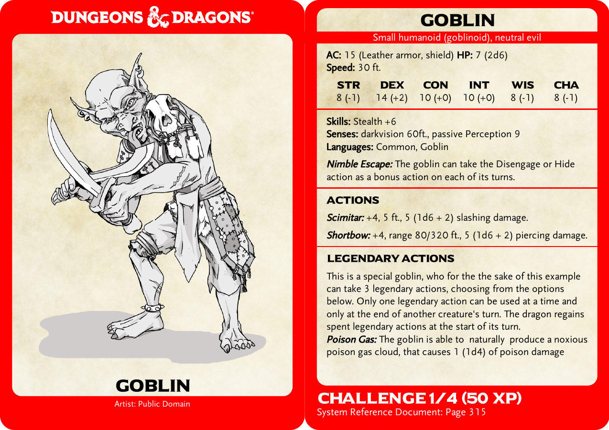

# Dungeons & Dragons Card Generator
A script to generate cards for Dungeons and Dragons in the style of the official Gale Force Nine ones.

At this time, only monster cards are supported



[](https://www.buymeacoffee.com/ep1cman)

# Setup
Before being able to use this script you will need to do the following:
 1. Install [Python 3](https://www.python.org/downloads/)
 1. Download and extract this repository (or use `git clone`)
 1. Open a terminal and navigate to the location you downloaded this repository to
 1. Run the following command from a terminals
 ```pip install -r requirements.txt```

# Usage
```
usage: CardGenerator.py [-h] [-t {monster}] [-o output_path]
                        [-f {free,accurate}]
                        input

Generate D&D cards.

positional arguments:
  input                 Path to input YAML file

optional arguments:
  -h, --help            show this help message and exit
  -t {monster}, --type {monster}
                        What type of cards to generate
  -o output_path, --out output_path
                        Output file path
  -f {free,accurate}, --fonts {free,accurate}
                        What fonts to use when generating cards
```
Included in the `example` directory is an example YAML file that generates a `Goblin` card.

# Input YAML
The input to this script is a YAML file that details all the attributes of the card. The details of what to include for each card type can be found below.

If you are having issues with your YAML file, you can use [YAML Lint](http://www.yamllint.com/) to verify your syntax. If that shows everything is ok, then double check your YAML matches the structure of the examples below. If you are still having issues, then please open a issue here on GitHub and I will try my best to assist.

Common Issues:
 - Entries that include a `:` must be surrounded by quotes `"` e.g: ``source: "System Reference Document: Page 315"``
 - The fields are case sensitive, make sure there are no capital letters. e.g ``title`` not ``Title``

## Monster Cards


Based on the Gale Force Nine Monster Cards. If the contents of the card exceeds the space available on a small card, it will automatically scale to a double width card, like the official ones. I am planning on adding a third card layout to accommodate monsters with a lot of text, which GF9 didn't include. The front of the card is automatically oriented to best fit the aspect ratio of the image provided.

## YAML Entry fields
- **title** - The title of the card that will appear at the bottom of the front of the card, and at the top of the back of the card
- **subtitle** - The white text that appears below the title on the back of the card
- **artist** - If this is provided, and not blank, white text below the title on the front of the card will show the artist of the cards artwork.
- **image_path** - Path to the image to insert on the front of the card. This can either be a full path, or relative to the location of the YAML file.
- **armor_class** - The armor class of the monster (top left of the card), can include any text e.g. ``15 (Leather armor, shield)``
- **max_hit_points** - The max hit points of the monster (top right of the card), can include any text e.g. ``7 (2d6)``
- **max_hit_points** - The speed of the monster (below armor_class), can include any text e.g. ``30ft., fly 60 ft.``
- **strength, dexterity, constitution, intelligence, wisdom, charisma** - Ability modifiers show at the top of the card. They can also include ability scores e.g. `-1` or `8 (-1)`
- **challenge_rating** - The challenge rating of the monster, white text show at the bottom of the back of the card
- **experience_points** - The experience points earned for defeating the monster, shown next to the challenge rating
- **source** - The source from which this cards information came from. e.g. ``"System Reference Document: Page 315"``
- **attributes** - A dictionary of the monsters "attributes", these appear in the top half of the second section of the card. Some common attributes include: `Skills`, `Senses`, `Languages`, `Damage Immunities`. The key will be typeset in **bold** while the value will be typeset as regular text.
- **abilities** - A dictionary of the monsters "abilities", these appear below the ``attributes`` in the second section of the card. The key will be typeset in *Italic* while the value will be typeset as regular text.
- **actions** - A dictionary of the monsters "actions", these appear in the third section of the card. The key will be typeset in **_Bold Italic_** while the value will be typeset as regular text.

### Example
``` YAML
- title: Goblin
  subtitle: Small humanoid (goblinoid), neutral evil
  artist: Public Domain
  image_path: example/Goblin.png
  armor_class: 15 (Leather armor, shield)
  max_hit_points: 7 (2d6)
  speed: 30 ft.
  strength: 8 (-1)
  dexterity: 14 (+2)
  constitution: 10 (+0)
  intelligence: 10 (+0)
  wisdom: 8 (-1)
  charisma: 8 (-1)
  challenge_rating: 1/4
  experience_points: 50
  source: "System Reference Document: Page 315"
  attributes:
    Skills: Stealth +6
    Senses: darkvision 60ft., passive Perception 9
    Languages: Common, Goblin
  abilities:
    Nimble Escape: The goblin can take the Disengage or Hide action as a bonus action on each of its turns.
  actions:
    Scimitar: +4, 5 ft., 5 (1d6 + 2) slashing damage.
    Shortbow: +4, range 80/320 ft., 5 (1d6 + 2) piercing damage.
```


# Fonts
Included in this repository are some free fonts that resemble the font used on the
official cards as close as possible (if you know of a better fit, please let me 
know!). If however you want to use the exact fonts used on the official cards you 
will need to put the following fonts into the `fonts` folder in TTF format:
- ModestoExpanded-Regular.ttf
- ModestoText-Light.ttf
- ModestoText-LightItalic.ttf
- ModestoText-Bold.ttf
- ModestoText-BoldItalic.ttf

# Acknowledgements
 - The parchment background image was taken from redit user Smyris' [monster manual template](https://www.reddit.com/r/DnD/comments/2x8u77/5e_tried_to_recreate_the_monster_manuals_style/).
 - Dungeons & Dragons logo is a white version of the SVG created by reddit user [morepurplemorebetter](https://www.reddit.com/r/DnD/comments/4t57fn/dd_5e_vector_icons/)
 - The included fonts are TTF versions of:
    - [Scaly Sans](https://github.com/jonathonf/solbera-dnd-fonts) by Solbera, Ryrok and jonathonf
    - [Universal Sans](https://www.dafont.com/universal-serif.font) by Khiam Mincey
